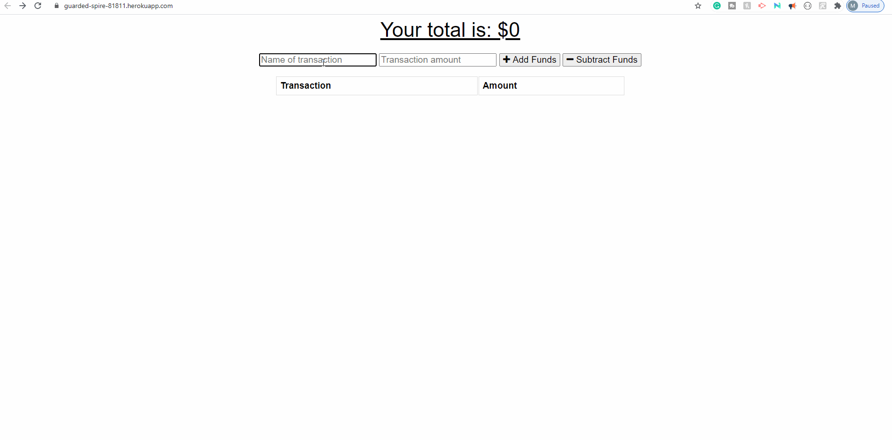

# pwa-budget-tracker
<!--linkedin logo-->
<a class="LI-simple-link" href='https://www.linkedin.com/in/maria-khan-9202471a3?trk=profile-badge'>Maria's LinkedIn  </a>

<!-- image for team tracker-->
  

  
  
## Demo 

### Heroku live demo

https://guarded-spire-81811.herokuapp.com/

## Table of Contents
* [General Information](#general-information)
* [App Preview](#app-preview)
* [Technologies](technologies)
* [Author](#author)

## General Information
This Budget Tracker is a progressive web application allows for offline access and functionality.

The user is be able to add expenses and deposits to their budget with or without a connection. When entering transactions offline the data is cached leveraging PWA (progressive web app), the cached data is then populated with the updated the total when brought back online.

## App Preview

Pending 

## Technologies
### Main Languages

* [JavaScript](https://developer.mozilla.org/en-US/docs/Web/JavaScript) - This application is written and programmed using ES6 JavaScript.

* [CSS](https://developer.mozilla.org/en-US/docs/Web/CSS) - Used to style the html elements/application.

* [HMTL5](https://developer.mozilla.org/en-US/docs/Web/HTML) - Used to give frontend html files their structure and DOM elements.

### Front-End Technologies

* [jQuery](https://jquery.com/) -  Used to simplify JavaScript code, DOM access/manipulation, and API requests.

* [Bootstrap](https://getbootstrap.com/) - Grid/Column system used to create responsive page layout/structure.  Also used to create and style several elements such as buttons, modals, carousels, etc.

### Back-End Technologies

* [Node](https://nodejs.org/en/) -Used for backend.

* [Express](https://expressjs.com/) -Used for backend framework.

* [MongoDB](https://www.mongodb.com/) - Used for database.

* [Mongoose](https://mongoosejs.com/) - Provides a straight-forward, schema-based solution to model your application data.

 

## Author

* **[Maria Khan](https://github.com/MariaKhantech)**